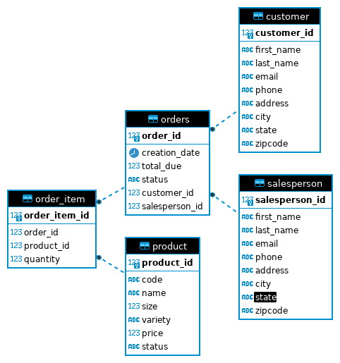

# **Introduction**
### This project is aimed at learning to use JDBC by implementing CRUD operations for the Hplussport database. I used JDBC to connect to the database and write my CRUD operations. I used Maven for automating the build of my project. Finally, I used DBeaver to visualize my database and test my queries.

# **Implementation**
## **ER Diagram**

## **Design Patterns**
### **The Data Access Object is a structural pattern that provides an interface that isolates the business layer of our application from our database. It encapsulates the CRUD operations needed for the data model and hides them from the business logic. In doing so, it assures a separation of concerns, which makes the code more maintainable and testable.**
### **The Repository Pattern works in a similar way than DAO, meaning that it also separates the business layer from the data persistence layer, but it is a higher level of abstraction than DAO and is in the domain layer. It abstracts the data access, data mapping and querying logic from the business side.**

# **Test**
### **I tested my application using DBeaver, by running my code and querying my database to verify that database setup and CRUD operations were correctly implemented.**
 