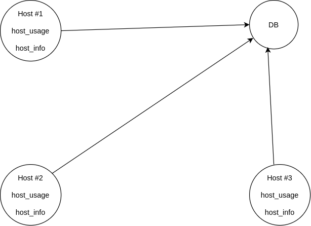

# **Introduction**

### This project aims to fulfill the requirements of the Linux Cluster Administration (LCA) team. The LCA team needs to effectively track and record the hardware specifications of each node in their infrastructure while also monitoring the real-time resource usage, including CPU and memory.

### To achieve this, the project implements a system that collects and stores the data in a RDBMS. By gathering this valuable information, the LCA team can generate insightful reports for future resource planning purposes, enabling them to make informed decisions such as adding or removing servers based on accurate resource utilization data. The technologies used are:

	- Bash is used to gather hardware and ressource usage information
	- Docker to use Postgres and PSQL
	- Git for version control
	- PSQL and PostgreSQL to store my data and manage and modify my database

# **Quickstart**

### 	- Start a psql instance

```sql
./scripts/psql_docker.sh start
```

###	- Create tables for the database

```sql
psql -h localhost -U postgres -d host_agent -f sql/ddl.sql
```

###	- Insert hardware specs data into the DB

```bash
bash scripts/host_usage.sh psql_host psql_port db_name psql_user psql_password
```

###	-Insert hardware usage data into the DB

```bash
bash scripts/host_info.sh psql_host psql_port db_name psql_user psql_password
```

###	-Crontab setup

```bash
crontab -e

* * * * * bash (Insert your full path to host_usage.sh) localhost 5432 host_agent postgres password > /tmp/host_usage.log
```

# **Implementation**

### The project is implemented using 2 bash scripts that will be installed on each Linux cluster and they will collect and store the necessary data in a Postgres database. The first script, host_info will only be executed once and will collect and store hardware data, while the other script, host_usage will be executed every minute and will collect and store system resource utilization. 

# **Architecture**



# **Scripts**

### - psql_docker.sh

```
This script is used to create our docker container and start or stop our docker instance
```

### - host_info.sh

```
This script is used to collect the user's hardware data and store it in our database.
It's only executed once.
```

### - host_usage.sh

```
This script is used to collect the user's resource utilization data and store it in our database.
It's executed every minute.
```

### - crontab

```
Crontab is used to execute automatically the host_usage script every minute.
```

# **Database Modeling**

### - host_info

| Column name | Data type        | Description                                              |
|-------------|------------------|----------------------------------------------------------|
| id          | SERIAL NOT NULL  | Auto-incremented integer that identifies a user (primary key) |
| hostname    | VARCHAR NOT NULL | Name of the host's domain name (unique)                  |  
| cpu_number | INT2 NOT NULL | Number of CPUs used by the kernel                        |
 | cpu_architecture | VARCHAR NOT NULL| The CPU's architecture type                              |
 | cpu_model | VARCHAR NOT NULL | Name of the CPU's model                                  | 
 | cpu_mhz | FLOAT8 NOT NULL | The CPU's clock speed                                    |
 | l2_cache | INT4 NOT NULL | The size of the level cache                              |
 | timestamp | TIMESTAMP NOT NULL | Current date and time in UTC zone                        | 
 | total_mem | INT4 NOT NULL| Size of the idle memory                                  |

### - host_usage

| Column name    | Data type          | Description                                                                      |
|----------------|--------------------|----------------------------------------------------------------------------------|
| timestamp      | TIMESTAMP NOT NULL | Current date and time in UTC zone                                                |
| host_id        | SERIAL NOT NULL    | Integer that uniquely identifies the user (foreign key from the host_info table) |  
| memory_free    | INT4 NOT NULL      | Size of the idle memory                                                          |  
| cpu_idle       | INT2 NOT NULL      | Time the CPU has spent idle                                                      |
| cpu_kernel     | INT2 NOT NULL      | Time spent running kernel code                                                   |
| disk_io        | INT4 NOT NULL      | Number of reads and writes in progress                                           | 
| disk_available | INT4 NOT NULL      | Root directory available disk space                                              |


# **Test**

### I created an empty database called host_agent and to test my ddl.sql script I executed it and verified if the host_usage and host_info tables were created, which was the case.

# **Deployment**

### I used a docker container so that any user would have access to Postgres and PSQL when using the system without having to download them. I also changed the execution permission on my scripts, especially host_usage.sh so that Crontab can execute it every minute. Finally, I pushed the system to Github so that the users can use the latest version of the project.

# **Improvements**

### - Add an alert system that would notify the user when their resource utilization exceeds a certain threshold
### - Daily report of the data collected
### - Resource allocation suggestions


